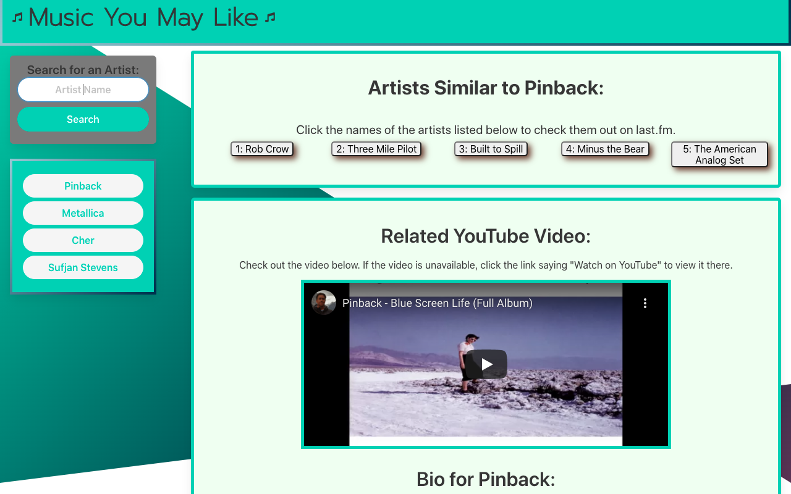

# Music-You-May-Like

## User-Story:
### As a music lover...
* I want to discover new musical artists based on artists I already like,
* so that I can learn about music and artists outside of my current libary.

## Work:
### To accomodate this request, we...
* Set up a webpage using HTML.
* Styled that page using the CSS framework Bulma, as well as some custom CSS styling of our own.
* Utlized the last.fm and YouTube APIs to access data related to musical artists and their work.
* Used JavaScript to fetch data related to an artist input by a user either via the search form or via a button click (for an already searched-for artist) from those APIs.
* Implemented functionality that displays 
> * user inputs on the page as buttons,
> * artists related to a searched-for artist,
> * a YouTube video relevant to a searched-for artist,
> * and a summarized biographical information for a searched-for artist, each in appropriate and cleanly laid-out elements on the page.
* Tracked, merged, and saved our progress using git and GitHub.

## Links:
* Link to the project's live URL: [Music-You-May-Like](https://tuckerlarrabee.github.io/Music-You-May-Like/)
* Link to the project's GitHub repo: [https://github.com/TuckerLarrabee/Music-You-May-Like](https://github.com/TuckerLarrabee/Music-You-May-Like) 
* Link to the project's presentation: [Music You May Like - Presentation](https://docs.google.com/presentation/d/1XJDvOXy83Q_CJqJ9zm0-IgOi-Dj8P-ulhuz8JWcEGgU/edit#slide=id.p)

## Screenshot:
 

## Credits:
### This project was completed via collaboration between Tucker Larrabee, Alan Phelps, and Michael Gannon.
